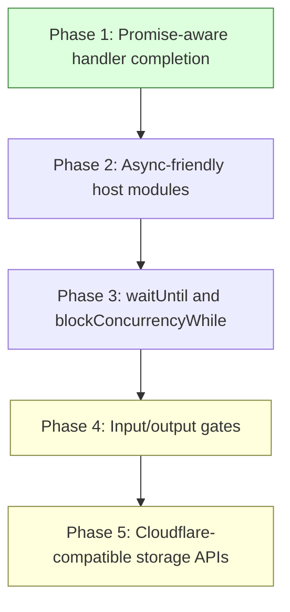

# Async Durable Objects Dispatch Design Guide

## Executive summary

`go-go-objects` currently implements the hard part of a local Durable Objects runtime: stable object identity, one live actor per object identity, one owned `goja.Runtime` per actor, SQLite-backed durable state, HTTP gateway dispatch, alarms, idle eviction, and xgoja/v2 serving. What it does not yet implement is the JavaScript async contract that Cloudflare users expect from Durable Objects. If an object method is declared `async`, the method returns a Promise. The current actor code calls the method, immediately exports the returned value, and therefore treats the Promise itself as the result rather than waiting for it to settle.

This ticket should add **Promise-aware actor dispatch**. The first version should not attempt full Cloudflare input gates, output gates, async storage, or `blockConcurrencyWhile`. It should solve the narrower and more urgent compatibility gap: `rpc`, `fetch`, and `alarm` handlers may return a `goja.Promise`, and the Durable Objects actor should wait for that Promise to settle before converting the result or error back into a Go `Result`.

The recommended implementation is to add an internal `awaitDispatchValue` helper in `pkg/durableobjects/actor.go`. Each dispatch kind should call the JavaScript function on the owner thread, return the raw `goja.Value` or no-value marker to Go, and let the helper poll Promise state through `RuntimeOwner.Call()` until the Promise is fulfilled, rejected, or the dispatch context expires. This follows existing go-go-goja precedent in `pkg/replsession/evaluate.go`, where returned Promises are detected and waited with context-aware polling.

The design deliberately keeps actor execution serialized for the first async milestone. While Cloudflare allows some interleaving around non-storage awaits, implementing interleaving correctly requires input gates, storage gates, and output gates. Those are separate runtime semantics, not a small Promise-await patch. The MVP should prefer correctness and predictable local behavior over premature Cloudflare completeness.

## Problem statement

A user writing a Durable Object naturally writes async JavaScript:

```js
class Counter {
  constructor(state, env) {
    this.state = state;
    this.env = env;
  }

  async increment(by = 1) {
    await Promise.resolve();
    const current = this.state.storage.get("count") || 0;
    this.state.storage.put("count", current + by);
    return current + by;
  }

  async fetch(req) {
    const count = await this.increment(0);
    return { status: 200, body: String(count) };
  }

  async alarm() {
    await Promise.resolve();
    this.state.storage.put("alarm", true);
  }
}

exports.objects = { Counter };
```

In Cloudflare Durable Objects this shape is normal. Cloudflare examples use `async fetch`, `async alarm`, and RPC methods that callers `await`. The extracted Cloudflare rules page explains that Durable Objects are single-threaded but JavaScript `async` / `await` can allow request interleaving while a request waits for asynchronous work; Cloudflare uses input and output gates to make this safe (`sources/01-cloudflare-rules-of-durable-objects.md:632-641`). The alarms documentation states directly that `alarm()` can be async (`sources/03-cloudflare-alarms.md:101-114`). The state API documents `blockConcurrencyWhile` as an async callback mechanism that blocks other events while the callback runs (`sources/02-cloudflare-state.md:50-96`).

The current `go-go-objects` implementation does not wait for returned Promises. The actor dispatch path calls `RuntimeOwner.Call()` and runs `dispatchOnOwner` (`pkg/durableobjects/actor.go:25-47`). `callRPC` invokes the target function and immediately marshals `value.Export()` (`pkg/durableobjects/actor.go:119-152`). `callFetch` invokes `instance.fetch(req)` and immediately interprets the return value as an object (`pkg/durableobjects/actor.go:155-191`). `callAlarm` invokes `instance.alarm()` and returns immediately (`pkg/durableobjects/actor.go:194-203`). None of these paths inspect `*goja.Promise`.

The result is a semantic mismatch:

| Handler shape | Cloudflare expectation | Current go-go-objects behavior |
| --- | --- | --- |
| `async rpcMethod()` | Await the returned Promise, return fulfilled value, propagate rejection. | Export the Promise object immediately. |
| `async fetch(req)` | Await the returned Promise, then convert fulfilled response. | Try to interpret the Promise as a response object. |
| `async alarm()` | Await handler completion; failed alarms can be retried by scheduler policy. | Return immediately after scheduling the Promise. |
| `state.storage.transaction(async () => ...)` | Not a direct Cloudflare equivalent for this MVP API. | Explicitly rejected if the callback returns a pending Promise (`pkg/durableobjects/modules.go:56-72`). |

This ticket exists to close the first three gaps without weakening the fourth invariant.

## Scope

### In scope

The first implementation should include:

1. Promise detection for RPC, fetch, and alarm handler return values.
2. Context-aware Promise waiting with CPU/dispatch timeout integration.
3. Rejection conversion into typed Durable Objects errors.
4. Fulfilled-value conversion for RPC and fetch.
5. Tests for fulfilled async RPC, rejected async RPC, async fetch, async alarm, and pending Promise timeout.
6. Documentation updates for supported async semantics and explicit non-goals.
7. TypeScript declaration updates if exported docs imply sync-only behavior.

### Out of scope for this ticket

Do not implement these in the first async dispatch patch:

1. Full Cloudflare input gates.
2. Full Cloudflare output gates.
3. Async storage methods such as `await state.storage.get(...)`.
4. Allowing async callbacks inside `state.storage.transaction(...)`.
5. Request interleaving within one object while one dispatch is awaiting non-storage I/O.
6. `ctx.waitUntil` lifecycle extension semantics.
7. `ctx.blockConcurrencyWhile` constructor initialization semantics.
8. WHATWG `Request` / `Response` compatibility.
9. WebSocket hibernation or async WebSocket handlers.

These features are related, but they each require their own correctness model. Promise-aware dispatch should be the foundation on which later compatibility work builds.

## Current-state analysis

### Actor dispatch is synchronous at the JavaScript boundary

`Actor.Dispatch` increments the active counter, touches `lastUsedNS`, and calls into the runtime owner (`pkg/durableobjects/actor.go:25-47`). That part is correct and should remain. The actor must remain active while a Promise is pending, because idle eviction must not close the runtime before the Promise settles.

The synchronous problem appears inside the dispatch kind methods. `callRPC` calls the method and immediately marshals the exported value (`pkg/durableobjects/actor.go:144-152`). If the value is a Promise, `value.Export()` is not the final JavaScript result. `callFetch` has the same issue, but it is more dangerous because it immediately calls `value.ToObject(vm)` and reads `status`, `headers`, and `body` (`pkg/durableobjects/actor.go:164-191`). `callAlarm` ignores the returned value entirely (`pkg/durableobjects/actor.go:194-203`), so an async alarm can fail after the Go runtime has already considered the alarm dispatched.

### CPU timeout support already exists and should be reused

`withInterrupt` sets a timer, interrupts the VM when the CPU budget expires, and maps the interruption to `CodeTimeout` (`pkg/durableobjects/actor.go:206-218` and the following lines in the current branch). This works for CPU-bound synchronous JavaScript. Promise waiting adds another kind of timeout: wall-clock waiting for a Promise that never settles. The same dispatch context should cover both CPU-bound loops and pending Promises.

The implementation should use one dispatch context with deadline. CPU-bound JavaScript should still be interrupted with `goja.Runtime.Interrupt`. Pending Promises should be observed by the Promise wait loop and return `CodeTimeout` or the context's cause when the context expires.

### Storage transactions already reject async callbacks

The storage transaction API currently calls the JavaScript callback and rejects pending Promises (`pkg/durableobjects/modules.go:56-72`). Keep this behavior. A transaction holds a SQLite transaction and expects the callback to finish synchronously. Awaiting inside that callback would suspend JavaScript while the transaction remains open, which creates unclear lock lifetime and cancellation behavior.

This rule should be documented as part of async dispatch support:

```js
// Supported: async method around synchronous transaction.
async update() {
  await Promise.resolve();
  this.state.storage.transaction(tx => {
    tx.put("x", 1);
  });
}

// Still unsupported: async transaction callback.
updateBroken() {
  return this.state.storage.transaction(async tx => {
    await Promise.resolve();
    tx.put("x", 1);
  });
}
```

### go-go-goja already contains Promise-waiting patterns

The repository already has working Promise wait code. `pkg/replsession/evaluate.go` detects returned Promises and either previews them or calls `waitPromise` depending on policy (`go-go-goja/pkg/replsession/evaluate.go:507-546`). The `waitPromise` helper polls Promise state by scheduling owner calls, handles context cancellation, returns fulfilled values, and converts rejected values into errors (`go-go-goja/pkg/replsession/evaluate.go:603-636`). The older JavaScript evaluator uses a similar polling loop (`go-go-goja/pkg/repl/evaluators/javascript/evaluator.go:313-361`).

These patterns are not perfect for Durable Objects, but they are the right starting point. They prove that polling Promise state through the runtime owner is acceptable in this codebase. The Durable Objects implementation should avoid importing REPL internals; instead, it should copy the small pattern into a local helper or, preferably, factor a reusable Promise helper into `go-go-goja` later.

### go-go-goja async module guidance is owner-thread first

The async patterns documentation says that goja runtimes are single-threaded from JavaScript's point of view, and any operation that touches JavaScript values, calls JavaScript functions, or resolves Promises must happen on the runtime owner (`go-go-goja/pkg/doc/03-async-patterns.md:22-105`). This is the most important constraint for this design. Promise state must be inspected on the owner. Fulfilled values must be converted on the owner. Rejections must be read on the owner.

## Cloudflare model and compatibility target

Cloudflare Durable Objects are async actors. The phrase needs precision. They are single-threaded for JavaScript execution, but `await` can yield the event loop. Cloudflare then layers gate semantics on top of the event loop.

The relevant Cloudflare concepts are:

- **Async handlers.** Examples and API docs use `async fetch`, async RPC methods, and async `alarm`. The alarms API explicitly states that `alarm()` can be async (`sources/03-cloudflare-alarms.md:101-114`).
- **RPC calls are awaited by callers.** The rules page repeatedly shows `await stub.method(...)` and has a section titled "Always await RPC calls" (`sources/01-cloudflare-rules-of-durable-objects.md:964-997`).
- **Input gates.** Cloudflare explains that async awaits can allow interleaving, but storage operations have input-gate behavior that prevents races around storage (`sources/01-cloudflare-rules-of-durable-objects.md:632-661`).
- **Output gates.** Cloudflare holds outgoing responses and network messages until pending storage writes complete (`sources/01-cloudflare-rules-of-durable-objects.md:662-682`).
- **blockConcurrencyWhile.** Cloudflare exposes an async callback that blocks other events while it runs, often used in constructors for initialization (`sources/02-cloudflare-state.md:50-96`).

The compatibility target for this ticket is intentionally narrower:

```text
Cloudflare-compatible enough for handler completion:
  await returned handler Promise before responding.

Not Cloudflare-compatible yet for event interleaving:
  keep one dispatch occupying the actor until its Promise settles.
```

This distinction should be visible in docs and tests. Users should be able to write `async` handlers that use Promises created by supported go-go-goja modules, but they should not expect Cloudflare's exact interleaving or gate behavior.

## Proposed architecture

### New internal dispatch shape

Today each dispatch method returns a final `Result`. Instead, split dispatch into two phases:

1. **Invoke phase:** Run JavaScript on the owner and return an intermediate value.
2. **Await/convert phase:** If the intermediate value is a Promise, wait for it. Then convert the fulfilled value into a `Result`.

Introduce a small internal type:

```go
type dispatchValueKind int

const (
    dispatchValueRPC dispatchValueKind = iota
    dispatchValueFetch
    dispatchValueAlarm
)

type dispatchValue struct {
    kind  dispatchValueKind
    value goja.Value // nil for alarm with no return value
}
```

Then change the actor flow conceptually:

```go
func (a *Actor) Dispatch(ctx context.Context, env Envelope) (Result, error) {
    a.active.Add(1)
    a.touch()
    defer func() { a.touch(); a.active.Add(-1) }()

    return a.withInterrupt(ctx, func(ctx context.Context) (Result, error) {
        raw, err := a.invokeDispatch(ctx, env)
        if err != nil { return Result{}, err }

        settled, err := a.awaitDispatchValue(ctx, raw)
        if err != nil { return Result{}, err }

        return a.convertDispatchValue(ctx, settled)
    })
}
```

This shape makes the important boundary explicit: the runtime waits for handler completion before conversion.

### Promise detection and waiting

Promise detection should use `value.Export().(*goja.Promise)` because existing go-go-goja code uses that pattern (`go-go-goja/pkg/replsession/evaluate.go:507-546`). The wait loop should poll state on the runtime owner:

```go
type promiseSnapshot struct {
    State  goja.PromiseState
    Result goja.Value
}

func (a *Actor) awaitValue(ctx context.Context, value goja.Value) (goja.Value, error) {
    if value == nil {
        return nil, nil
    }
    promise, ok := value.Export().(*goja.Promise)
    if !ok {
        return value, nil
    }

    ticker := time.NewTicker(5 * time.Millisecond)
    defer ticker.Stop()

    for {
        select {
        case <-ctx.Done():
            return nil, timeoutOrContextError(ctx)
        case <-ticker.C:
        }

        ret, err := a.runtime.Owner.Call(ctx, "durable-object.promise-state", func(_ context.Context, vm *goja.Runtime) (any, error) {
            return promiseSnapshot{State: promise.State(), Result: promise.Result()}, nil
        })
        if err != nil {
            return nil, err
        }
        snap := ret.(promiseSnapshot)
        switch snap.State {
        case goja.PromiseStatePending:
            continue
        case goja.PromiseStateFulfilled:
            return snap.Result, nil
        case goja.PromiseStateRejected:
            return nil, durablePromiseRejected(snap.Result)
        }
    }
}
```

The helper must not read `promise.State()` or `promise.Result()` from a non-owner goroutine. Even though those methods appear simple, the runtime ownership rule is more important than convenience.

### Conversion after awaiting

RPC conversion should happen after the Promise is fulfilled:

```go
func (a *Actor) convertRPCValue(ctx context.Context, value goja.Value) (Result, error) {
    ret, err := a.runtime.Owner.Call(ctx, "durable-object.rpc-result", func(_ context.Context, vm *goja.Runtime) (any, error) {
        payload, err := json.Marshal(value.Export())
        if err != nil {
            return nil, wrap(CodeExecutionError, "encode rpc result", err)
        }
        return payload, nil
    })
    if err != nil { return Result{}, err }
    return Result{ValueJSON: ret.([]byte)}, nil
}
```

Fetch conversion should also happen after awaiting. Keep the existing plain DTO semantics:

```go
func (a *Actor) convertFetchValue(ctx context.Context, value goja.Value) (Result, error) {
    ret, err := a.runtime.Owner.Call(ctx, "durable-object.fetch-result", func(_ context.Context, vm *goja.Runtime) (any, error) {
        return fetchResponseFromValue(vm, value)
    })
    if err != nil { return Result{}, err }
    response := ret.(FetchResponse)
    return Result{Response: &response}, nil
}
```

Alarm conversion is simpler. Await fulfillment and ignore the fulfilled value. Rejection should return an error so `Manager.DispatchDueAlarms` can decide retry/index behavior.

### Timeout model

Use a single dispatch deadline. The existing `Options.CPUTimeout` name is slightly narrow once Promises are supported. The least disruptive approach is:

- Keep `Options.CPUTimeout` for now as the dispatch budget.
- Document that it covers synchronous CPU execution and Promise settlement wait time.
- Add a future `DispatchTimeout` option only if users need separate wall-clock and CPU budgets.

`withInterrupt` should accept the dispatch context or derive one:

```go
func (a *Actor) dispatchContext(ctx context.Context) (context.Context, context.CancelFunc) {
    if a.cpuTimeout <= 0 {
        return context.WithCancel(ctx)
    }
    return context.WithTimeout(ctx, a.cpuTimeout)
}
```

When the context expires, interrupt the VM so CPU-bound code stops. When the Promise wait loop observes context expiration, return `CodeTimeout`.

### Rejection model

Promise rejection should become `CodeExecutionError` unless the rejection value already represents a typed durable object error. Keep the first implementation simple:

```go
func promiseRejectedError(value goja.Value) error {
    return coded(CodeExecutionError, "durable object promise rejected: %s", valueString(value))
}
```

A later patch can preserve JavaScript stack traces or encode structured rejection values in dev mode.

### Actor activity and eviction

No new eviction mechanism is required. `Actor.Dispatch` already increments `active` before entering JavaScript and decrements it after the result returns (`pkg/durableobjects/actor.go:25-35`). If Promise waiting happens inside `Dispatch`, the actor remains active while the Promise is pending. `EvictIdle` therefore continues to skip active actors.

This is also why the first version should not allow Cloudflare-style interleaving. The actor is active for the full Promise lifetime, so only one dispatch is in flight. That behavior is conservative and easy to reason about.

## Diagrams

### Current synchronous dispatch

```mermaid
sequenceDiagram
    participant HTTP as Gateway / Module
    participant Actor as Actor.Dispatch
    participant Owner as RuntimeOwner
    participant JS as JS Instance

    HTTP->>Actor: Envelope{KindRPC}
    Actor->>Owner: Call("durable-object.rpc")
    Owner->>JS: instance.method(...args)
    JS-->>Owner: Promise or value
    Owner-->>Actor: Result built immediately
    Actor-->>HTTP: Result

    Note over Actor,HTTP: Promise is not awaited today.
```

### Proposed Promise-aware dispatch

```mermaid
sequenceDiagram
    participant HTTP as Gateway / Module
    participant Actor as Actor.Dispatch
    participant Owner as RuntimeOwner
    participant JS as JS Instance
    participant Promise as goja.Promise

    HTTP->>Actor: Envelope{KindRPC}
    Actor->>Owner: invoke method on owner
    Owner->>JS: instance.method(...args)
    JS-->>Owner: value or Promise
    Owner-->>Actor: raw dispatch value

    alt raw value is Promise
        loop until fulfilled/rejected/timeout
            Actor->>Owner: read Promise state
            Owner->>Promise: State + Result
            Promise-->>Owner: pending/fulfilled/rejected
            Owner-->>Actor: snapshot
        end
    end

    Actor->>Owner: convert fulfilled value
    Owner-->>Actor: Result DTO
    Actor-->>HTTP: Result or typed error
```

### Compatibility layers



## Decision records

### Decision: Await returned handler Promises before conversion

- **Context:** Cloudflare Durable Objects handlers commonly return Promises. Current `callRPC`, `callFetch`, and `callAlarm` do not inspect Promise state and therefore return too early.
- **Options considered:** Keep sync-only dispatch and document it; await Promises only for RPC; await Promises for RPC/fetch/alarm.
- **Decision:** Await returned Promises for all three dispatch kinds.
- **Rationale:** RPC, fetch, and alarm are all handler completion boundaries. Treating only RPC as async would leave `async fetch` and `async alarm` broken in ways users will hit immediately.
- **Consequences:** Dispatch now has a wall-clock wait component. Timeout tests become mandatory. Actor activity spans the Promise lifetime.
- **Status:** proposed.

### Decision: Preserve serialized dispatch for the first async milestone

- **Context:** Cloudflare allows some event interleaving around awaits, protected by input/output gates. go-go-objects currently serializes dispatch through one actor runtime owner call at a time.
- **Options considered:** Implement Cloudflare-style interleaving now; keep full-dispatch serialization; add opt-in interleaving without gates.
- **Decision:** Keep full-dispatch serialization until input/output gates are designed.
- **Rationale:** Interleaving without gates can introduce storage races. Full serialization is less concurrent but correct and matches the existing actor invariant.
- **Consequences:** Async handlers work, but throughput and interleaving differ from Cloudflare. Documentation must state this clearly.
- **Status:** proposed.

### Decision: Keep storage transactions synchronous

- **Context:** `state.storage.transaction` currently rejects pending Promise callbacks. Async transaction callbacks would keep SQLite transactions open across awaits.
- **Options considered:** Allow async transaction callbacks; reject async callbacks; remove transactions until async storage exists.
- **Decision:** Keep rejecting pending Promise callbacks inside transactions.
- **Rationale:** SQLite transaction lifetime must remain bounded and deterministic. Users can write async methods that perform synchronous transactions inside them.
- **Consequences:** Some Cloudflare-style async code remains unsupported, but transaction safety is preserved.
- **Status:** proposed.

### Decision: Implement Promise waiting locally first, factor later

- **Context:** go-go-goja has Promise wait loops in REPL/session packages, but no obvious public engine-level helper.
- **Options considered:** Copy a small helper into `pkg/durableobjects`; add a new public `engine.AwaitPromise` helper first; import REPL internals.
- **Decision:** Implement a local helper in `pkg/durableobjects` first, then factor into go-go-goja if another runtime package needs it.
- **Rationale:** This keeps the PR scoped to go-go-objects and avoids stabilizing a public API before requirements are known.
- **Consequences:** Some short-term duplication exists. A follow-up can consolidate once Durable Objects tests validate the desired API.
- **Status:** proposed.

### Decision: Treat `CPUTimeout` as dispatch timeout for now

- **Context:** Current options expose `CPUTimeout`. Promise waiting adds a wall-clock wait dimension.
- **Options considered:** Rename now to `DispatchTimeout`; add a second option; reuse `CPUTimeout` for the first milestone.
- **Decision:** Reuse `CPUTimeout` as the total dispatch budget for now.
- **Rationale:** It preserves public config shape and gives users one budget that covers both CPU loops and never-settling Promises.
- **Consequences:** The name is imperfect. Release notes should mention the widened meaning, and a future `DispatchTimeout` can be added without removing `CPUTimeout` immediately.
- **Status:** proposed.

## API sketches

### Internal actor helpers

```go
type promiseSnapshot struct {
    State  goja.PromiseState
    Result goja.Value
}

func (a *Actor) invokeRPC(ctx context.Context, method string, argsJSON []byte) (goja.Value, error)
func (a *Actor) invokeFetch(ctx context.Context, req *FetchRequest) (goja.Value, error)
func (a *Actor) invokeAlarm(ctx context.Context) (goja.Value, error)

func (a *Actor) awaitValue(ctx context.Context, value goja.Value) (goja.Value, error)
func (a *Actor) convertRPCResult(ctx context.Context, value goja.Value) (Result, error)
func (a *Actor) convertFetchResult(ctx context.Context, value goja.Value) (Result, error)
func (a *Actor) promiseRejectedError(ctx context.Context, value goja.Value) error
```

Keep these unexported. The public API should not expose `goja.Value`.

### JavaScript authoring contract after this ticket

Supported:

```js
class Counter {
  async increment(by = 1) {
    await Promise.resolve();
    const current = this.state.storage.get("count") || 0;
    this.state.storage.put("count", current + by);
    return current + by;
  }

  async fetch(req) {
    const value = await this.increment(0);
    return { status: 200, body: String(value) };
  }

  async alarm() {
    await Promise.resolve();
    this.state.storage.put("alarm-ran", true);
  }
}
```

Still unsupported:

```js
class Counter {
  brokenTransaction() {
    return this.state.storage.transaction(async tx => {
      await Promise.resolve();
      tx.put("x", 1);
    });
  }
}
```

Explicitly different from Cloudflare for now:

```js
class WorkerLikeObject {
  async slowExternalCall() {
    await fetch("https://example.com");
    // In Cloudflare, other events may interleave around non-storage awaits.
    // In go-go-objects Phase 1, this actor dispatch remains active and serialized.
  }
}
```

## Implementation plan

### Phase 1: Add tests that expose the current gap

Add tests before changing dispatch. The tests should fail on current main and pass after the implementation.

Recommended tests in `pkg/durableobjects/durableobjects_test.go`:

1. `TestAsyncRPCAwaited`:
   - Bundle method returns `Promise.resolve(42)` or `async value() { await Promise.resolve(); return 42; }`.
   - Dispatch RPC.
   - Assert result JSON decodes to `42`.
2. `TestAsyncRPCRejected`:
   - Method returns `Promise.reject(new Error("boom"))`.
   - Assert `CodeExecutionError` and dev gateway returns a 500 with useful message.
3. `TestAsyncFetchAwaited`:
   - `async fetch(req)` returns `{ status: 201, headers: {...}, body: "ok" }` after an await.
   - Assert gateway writes status/body/headers.
4. `TestAsyncAlarmAwaited`:
   - `async alarm()` awaits and then writes `alarmCount`.
   - Dispatch due alarm and assert storage changed before dispatch returns.
5. `TestPendingPromiseTimesOut`:
   - Method returns `new Promise(() => {})`.
   - Configure short timeout.
   - Assert `CodeTimeout` and HTTP 504.
6. `TestAsyncTransactionCallbackStillRejected`:
   - Existing behavior remains enforced.

### Phase 2: Refactor actor invocation and conversion

Change `callRPC`, `callFetch`, and `callAlarm` so they do not immediately convert returned values. There are two viable implementation shapes.

Shape A is minimal but keeps more logic in one owner call:

```go
func (a *Actor) callRPC(vm *goja.Runtime, method string, argsJSON []byte) (dispatchValue, error)
```

Shape B is clearer for Promise waiting:

```go
func (a *Actor) invokeRPC(ctx context.Context, method string, argsJSON []byte) (goja.Value, error)
func (a *Actor) finishRPC(ctx context.Context, value goja.Value) (Result, error)
```

Prefer Shape B. It separates JavaScript invocation from final conversion and makes the await step explicit.

### Phase 3: Add Promise waiting helper

Implement `awaitValue` with owner-thread polling. Reuse the polling interval from REPL/session code initially: 5ms. Keep it private.

Important details:

- Poll Promise state through `RuntimeOwner.Call`.
- Check `ctx.Done()` before each poll and during sleeps.
- Convert rejection on the owner thread into a string or exported value.
- Return `CodeTimeout` for dispatch deadline expiration.
- Do not hold manager locks while waiting.

### Phase 4: Integrate timeout and interrupt behavior

Revise `withInterrupt` so it supports both CPU-bound JavaScript and pending Promises. A robust shape is:

```go
func (a *Actor) withDispatchBudget(ctx context.Context, fn func(context.Context) (Result, error)) (Result, error) {
    dispatchCtx, cancel := context.WithCancel(ctx)
    if a.cpuTimeout > 0 {
        dispatchCtx, cancel = context.WithTimeout(ctx, a.cpuTimeout)
    }
    defer cancel()

    stop := make(chan struct{})
    done := make(chan struct{})
    go func() {
        select {
        case <-dispatchCtx.Done():
            a.runtime.VM.Interrupt(coded(CodeTimeout, "durable object dispatch timed out"))
        case <-stop:
        }
        close(done)
    }()

    result, err := fn(dispatchCtx)
    close(stop)
    <-done
    a.runtime.VM.ClearInterrupt()
    return result, normalizeTimeout(dispatchCtx, err)
}
```

The actual implementation may be simpler, but it must cover both synchronous loops and Promise waits.

### Phase 5: Update docs, examples, and TypeScript declarations

Update:

- `README.md`: state that async RPC/fetch/alarm handlers are awaited.
- `docs/release-notes.md`: note Promise-aware dispatch and remaining non-goals.
- `pkg/xgoja/providers/durableobjects/durableobjects.go` TypeScript declarations if they imply sync-only returns.
- `examples/counter/objects.js`: optionally add one async method to demonstrate support.

### Phase 6: Validate generated binary behavior

After unit tests pass, rebuild the xgoja counter example and smoke-test both serving paths:

```bash
cd /home/manuel/workspaces/2026-06-12/goja-durable-objects/go-go-goja
go run ./cmd/xgoja build \
  -f ../go-go-objects/examples/counter/xgoja-buildspec.yaml \
  --output /tmp/durableobjects-counter

/tmp/durableobjects-counter serve durableobjects site \
  --http-listen 127.0.0.1:18887 \
  --durableobjects-storage-root /tmp/do-async-http
```

Then add async example calls if the example bundle exposes them.

## Testing strategy

### Unit tests

Unit tests should be deterministic and fast. Avoid timers longer than a few milliseconds. For pending Promises, configure `Options{CPUTimeout: 10 * time.Millisecond}` and allow a generous Go test deadline.

Test matrix:

| Test | Purpose |
| --- | --- |
| Async RPC fulfillment | Returned Promise value becomes RPC JSON result. |
| Async RPC rejection | Rejected Promise becomes typed execution error. |
| Async fetch fulfillment | Fulfilled response object controls status/body/headers. |
| Async fetch rejection | Rejected Promise maps to gateway error. |
| Async alarm fulfillment | Alarm side effects finish before dispatch returns. |
| Async alarm rejection | Due alarm dispatch reports error and does not silently drop failure. |
| Pending Promise timeout | Never-settling Promise returns `CodeTimeout`. |
| CPU loop timeout | Existing spin timeout behavior still returns `CodeTimeout`. |
| Async transaction callback rejection | Transaction callback Promise is still rejected. |
| Idle eviction while Promise pending | Active actor is not evicted while async dispatch waits. |

### Integration tests

Provider integration should verify that `durableobjects.rpc(...)` can call an async object method and receive the fulfilled value. Gateway integration should verify `/rpc` and `/fetch` paths.

### Race and lifecycle tests

The most important lifecycle regression is closing the runtime while a Promise is pending. Add a test that starts a pending Promise dispatch, attempts idle eviction, verifies no eviction, then cancels the context and verifies cleanup.

### Manual smoke tests

Run:

```bash
GOWORK=off go test ./... -count=1
GOWORK=off golangci-lint run --timeout=5m
GOWORK=off gosec -exclude=G101,G304,G301,G306,G204 -exclude-dir=.history ./...
GOWORK=off govulncheck ./...
docmgr doctor --ticket GOJA-DO-002 --stale-after 30
```

Then run the generated binary smoke test if examples change.

## Risks and mitigations

### Risk: Promise waiting deadlocks because the event loop is not running

The actor runtime is built from `engine.RuntimeFactory`, which starts a goja event loop. Promise microtasks and supported async modules should have a running loop. The Promise wait loop must not block the owner thread permanently. It should inspect state in short owner calls and sleep outside the owner.

### Risk: Context cancellation leaves interrupted state behind

Always clear VM interrupts after timeout handling. Existing code already does this for CPU timeouts; async dispatch must preserve that cleanup.

### Risk: Rejection messages lose JavaScript stack context

The first version can return a clear rejection message. A later version can include stack traces in dev mode. Do not block Promise support on rich stack formatting.

### Risk: Users assume Cloudflare input/output gates exist

Documentation must say that Promise-returning handlers are awaited, but Cloudflare-style event interleaving and output gates are not yet implemented. This is a compatibility level, not full runtime equivalence.

### Risk: Async storage becomes tempting to fake

Do not make synchronous storage functions return already-resolved Promises just to match syntax. That can mask transaction and output-gate semantics. If async storage is added later, design it explicitly.

## Alternatives considered

### Alternative: Keep dispatch sync-only and document it

This is the simplest implementation, but it leaves the runtime surprising for JavaScript authors. Cloudflare Durable Objects examples are async-heavy, and xgoja already supports Promise-based modules. Sync-only dispatch should not be the long-term contract.

### Alternative: Await Promises inside the owner call

This would keep all logic in one `RuntimeOwner.Call`, but a pending Promise would block the owner call while the event loop needs to progress. Polling from outside the owner with short owner calls is safer and follows existing go-go-goja code.

### Alternative: Implement full Cloudflare gates first

This is attractive for compatibility, but it is too large for one ticket. Gates require tracking storage operations, outgoing responses, event interleaving, and failure behavior. Promise-aware handler completion is a smaller step and a prerequisite.

### Alternative: Add async storage first

Async storage would make examples look more like Cloudflare, but it does not solve the core problem unless dispatch awaits returned Promises. Handler Promise support should come first.

## File reference map

| File | Why it matters |
| --- | --- |
| `pkg/durableobjects/actor.go` | Main implementation target: dispatch, JS invocation, Promise waiting, timeout behavior. |
| `pkg/durableobjects/modules.go` | Storage API and transaction synchronous-callback rule. |
| `pkg/durableobjects/gateway.go` | HTTP mapping for timeout/rejection errors. |
| `pkg/durableobjects/durableobjects_test.go` | Core regression test location. |
| `pkg/xgoja/providers/durableobjects/durableobjects.go` | Provider RPC/fetch exports and TypeScript declarations. |
| `go-go-goja/pkg/replsession/evaluate.go` | Existing context-aware Promise wait implementation. |
| `go-go-goja/pkg/repl/evaluators/javascript/evaluator.go` | Smaller Promise polling precedent. |
| `go-go-goja/pkg/doc/03-async-patterns.md` | Owner-thread rule for async APIs and Promise settlement. |
| `sources/01-cloudflare-rules-of-durable-objects.md` | Cloudflare input/output gate and async Durable Object guidance. |
| `sources/02-cloudflare-state.md` | `waitUntil` and `blockConcurrencyWhile` reference. |
| `sources/03-cloudflare-alarms.md` | Async alarm handler reference. |

## Intern implementation checklist

Use this checklist when implementing the ticket:

1. Read `pkg/durableobjects/actor.go` from top to bottom.
2. Run the current tests before editing.
3. Add failing async tests first.
4. Refactor invocation and conversion without changing public APIs.
5. Add `awaitValue` and Promise rejection conversion.
6. Integrate timeout handling.
7. Keep `state.storage.transaction` synchronous-only.
8. Update docs and examples.
9. Run unit tests, lint, security checks, and docmgr doctor.
10. If xgoja examples changed, rebuild and smoke-test the generated binary.

## Open questions

1. Should `CPUTimeout` be renamed or complemented by `DispatchTimeout` after Promise support lands?
2. Should Promise waiting be factored into a public go-go-goja helper after this implementation proves the needed API?
3. Should rejected Promise values preserve JavaScript stack traces in dev mode?
4. What should alarm retry policy be when an async alarm rejects after the alarm index was cleared before dispatch?
5. Which Cloudflare compatibility feature should follow: `blockConcurrencyWhile`, `waitUntil`, input/output gates, or async storage APIs?

## References

- Cloudflare Rules of Durable Objects: `sources/01-cloudflare-rules-of-durable-objects.md`.
- Cloudflare Durable Object State API: `sources/02-cloudflare-state.md`.
- Cloudflare Durable Object Alarms API: `sources/03-cloudflare-alarms.md`.
- Cloudflare Durable Object lifecycle: `sources/04-cloudflare-durable-object-lifecycle.md`.
- Local line evidence: `various/01-line-evidence.md`.
- Prior runtime guide: `../06/12/GOJA-DO-001--implement-durable-objects-for-go-go-goja/design-doc/01-durable-objects-architecture-and-implementation-guide.md`.
